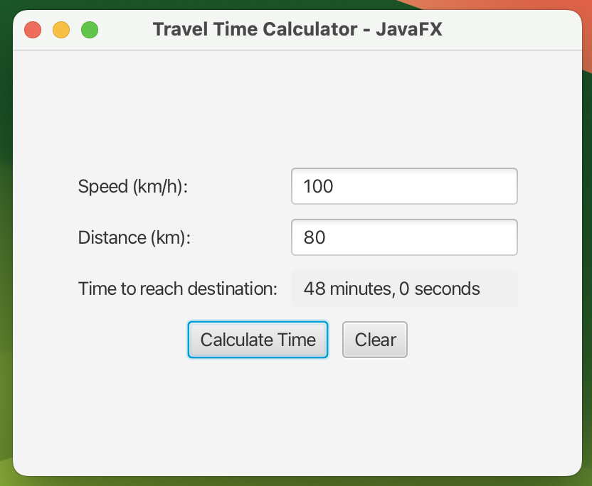

# TimeCalculator JavaFX XQuartz Jenkins Docker macOS

On macOS, you can use XQuartz as the X11 server, and connect your Docker container to it.

### 1. Install XQuartz (if not installed):
```shell
brew install --cask xquartz
```

or download it from homepage:

https://www.xquartz.org/

### 2. Open XQuartz App:
In settings -> Security -> Allow connections from network clients

### 3. Open XQuartz:
```sh
open -a XQuartz # Make sure XQuartz is running
```

### 4. Set DISPLAY terminal:
```shell
export DISPLAY=:0 # Set display for terminal
echo $DISPLAY
# should print :0
```

### 5. Allow connections to XQuartz:
```shell
ip=$(ifconfig en0 | grep inet | awk '$1=="inet" {print $2}') # Get Mac IP
/opt/X11/bin/xhost + $ip # Allow this IP to connect
```

If that still says “unable to open display”, try:
```shell
/opt/X11/bin/xhost +
```
This temporarily disables access control so Docker containers can connect.

### 6. Build Docker Image:
```shell
docker build -t timecalculator . # Use correct name
```

### 7. Run:
```sh
docker run -it --rm \
    -e DISPLAY=host.docker.internal:0 \
    -v /tmp/.X11-unix:/tmp/.X11-unix \
    timecalculator # Use correct name
```

If error use mvn clean:

clean → deletes the target/ folder

```shell
mvn clean javafx:run
```

or use:

```sh
 mvn javafx:run -Drecompile=true
```
Skips the clean step → keeps the old target/ folder.



On macOS, JavaFX GUIs are best run locally, not inside Docker.
